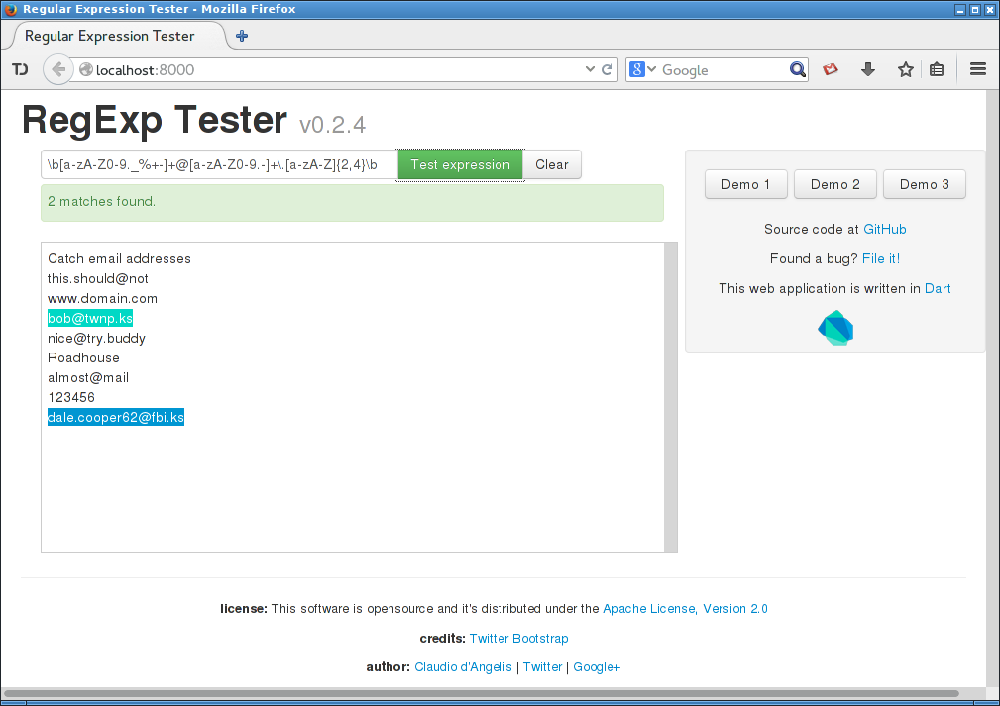

# RegExp Tester

A RegExp tester built with [Dart](http://www.dartlang.org).

Hosted version at [GitHub Pages](http://claudiodangelis.github.io/dart_regexp_tester/)

Author [Claudio d'Angelis](http://www.claudiodangelis.com/about)

## Screenshot

## TODO

- Avoid several identical elment.attribute calls 
- ~~Group `status`-related statements under a single function~~
- Add a "Quick Reference" panel
- Replace third party components with CDN mirrors
- Fix input width on small displays

## Credits

Graphic interface improved with [Twitter Bootstrap](twitter.github.com/bootstrap)

_See LICENSE_